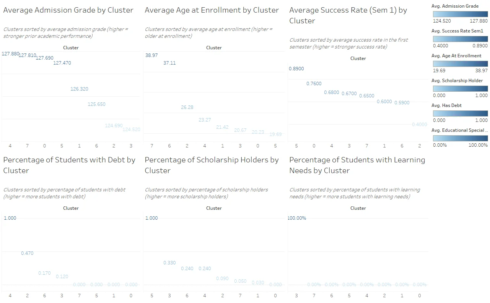

# Clustering Student Pathways to Inform Equitable Interventions



## Problem

Educational institutions often lack visibility into distinct student success pathways, which makes it difficult to identify inequities early and design targeted interventions.

## Data

**Public Dataset**: "Predict Students' Dropout and Academic Success" from a Portuguese higher education institution
- **Size**: 4,424 students, 36 variables
- **Features**: Academic performance, demographics, financial indicators
- **Status**: Pre-cleaned; this project focuses on analysis, clustering, and equity-oriented interpretation
- **Source**: Published academic research dataset (available through institutional data repositories)

## Methods

- **Feature selection + scaling**: Standardization/robust scaling for numerical features
- **Clustering**: K-Means clustering (k=8) chosen via metric triangulation (elbow/inertia + Davies-Bouldin + interpretability)
- **Visualization**: UMAP for 2D cluster visualization
- **Cluster profiling**: Per-cluster averages + outcome breakdowns
- **Fairness audit**: Chi-square tests for association between cluster membership and sensitive attributes (gender, age bin)

## Outcome / Insight

Identified distinct student profiles with clear differences in success rate, dropout risk, debt, scholarship status, and age. High-risk clusters were characterized by older age + debt + low early success, while high-performing clusters aligned with scholarship support and stronger early success.

### Key Findings

- **Cluster 4**: Highest success rate (89%) - younger students with scholarships and strong early performance
- **Cluster 1**: High dropout risk (40%) - older learners with debt and lower initial success
- **Equity insights**: Age and financial support emerged as critical differentiators, suggesting need for targeted interventions for non-traditional, financially burdened students

## Why This Matters

This workflow shows how unsupervised learning can surface hidden inequities and support data-informed, equity-centered intervention planning (e.g., targeting supports for financially burdened older learners), while explicitly auditing demographic skews to reduce harm.

## Artifacts

- **Notebook**: `notebooks/DSP562_Final_Clustering_Fairness__1_.ipynb` (full analysis + exports)
- **Tableau Dashboard**: Screenshots in `images/` and workbook in `dashboards/`
- **Report**: Full analysis documentation in `reports/`
- **Key exports**: `cluster_profiles_avg.csv`, `students_clustered.csv` (generated by notebook)

## Reproducibility

### Setup

1. Clone this repository
2. Install dependencies: `pip install -r requirements.txt`
3. Download data from Kaggle (see `data/README.md`)
4. Run notebook from repository root

### Environment

- Python 3.8+
- Key libraries: numpy, pandas, scikit-learn, umap-learn, matplotlib, seaborn, scipy

### Running the Analysis

```bash
# From repository root
jupyter notebook notebooks/DSP562_Final_Clustering_Fairness__1_.ipynb
```

The notebook is designed to run top-to-bottom with reproducible results (seeds set where appropriate).

## Repository Structure

```
student-pathway-clustering/
├── notebooks/           # Jupyter notebook with full analysis
├── reports/            # Final project report (PDF/DOCX)
├── dashboards/         # Tableau workbook (.twbx)
├── images/             # Dashboard screenshots and key visualizations
├── data/               # Data download instructions (raw data not included)
├── README.md           # This file
├── requirements.txt    # Python dependencies
├── .gitignore         # Git ignore rules
└── LICENSE            # MIT License
```

## Notes / Limitations

- K-Means assumes roughly spherical clusters and requires choosing k
- Clusters overlap and should be interpreted as segments for support planning, not deterministic labels
- Analysis focuses on patterns within this specific institutional context; generalization requires validation
- Fairness audit demonstrates methodological approach but institutional action requires deeper stakeholder engagement

## Skills Demonstrated

- Unsupervised machine learning (K-Means clustering, UMAP)
- Statistical analysis (chi-square tests, cluster validation metrics)
- Equity-centered data science practices
- Data visualization for technical and non-technical audiences
- Reproducible research practices

## Contact

Connect with me on [LinkedIn](https://www.linkedin.com/in/yourprofile) | View my [Portfolio](https://yourportfolio.com)

---

*This project was completed as part of a Data Science master's program, demonstrating practical application of machine learning to real-world educational challenges.*
